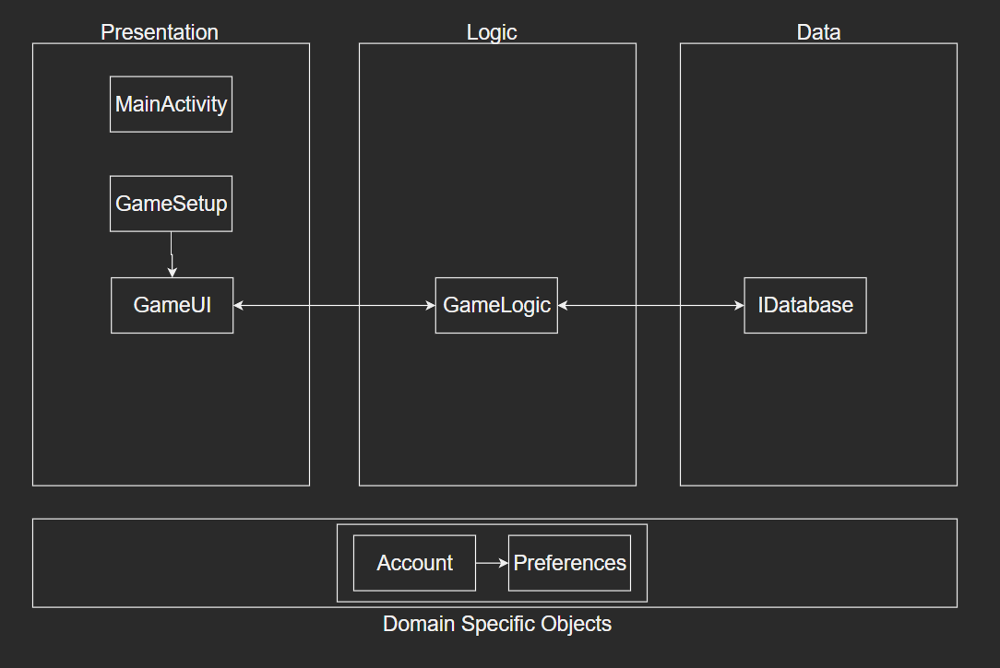

# Architecture

This project uses a 3-tier architecture. UI/Presentation, Logic, and Data.

Presentation is covered primarily by *MainActivity*, *GameSetup* and *GameUI*, in ui package.

Logic is handled by *GameLogic*, in logic package.

Data is implemented in the *IDatabase* file (in interfaces package), with the implementation being in *MockDatabase*, in persistence package.

The architecture diagram is a separate image called "ARCHITECTURE.png"

