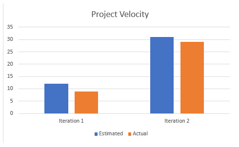

What technical debt has been cleaned up
========================================

Show links to a commit where you paid off technical debt. Write 2-5 sentences
that explain what debt was paid, and what its classification is.

### Reponse

During the first iteration, our timer for the game had a memory leak. This caused long running applications to slow down, or become unstable. During the below commit, this technical debt was paid off:

https://code.cs.umanitoba.ca/winter-2022-a02/group-1/cool-sentence-game/-/commit/01ad5c8e510200136b80e1273e3645d4bf6e1173

In order to fix this, we had to completely rewrite how the timer worked, and were unable to get a fix out until the second iteration. We would classify this technical debt as "Inadvertant Reckless". Inadvertant, because we did not know that implementing the timer in the way we did would lead to a memory leak, and technical debt. Reckless because we were new to the software (Android Studio) at the time, and had not looked into what might cause memory leaks.

What technical debt did you leave?
==================================

What one item would you like to fix, and can't? Anything you write will not
be marked negatively. Classify this debt.

### Response

SettingsActivity, on line 34 and 35, there is a very thrown together bandaid for a crash. It does prevent the crash, but it prevents it in a "smelly" way. We would classify this as Deliberate Reckless. It is Deliberate because we know it's there, and we know it's going to be an issue in the future. It's reckless because we don't have time to try and think of anything better, so we are using the first fix that we came up with. We don't have time to design a better solution.

Discuss a Feature or User Story that was cut/re-prioritized
============================================

When did you change the priority of a Feature or User Story? Why was it
re-prioritized? Provide a link to the Feature or User Story. This can be from any
iteration.

### Response

We changed the priority of the feature "Instructions on how to run the program." Initially we wanted to provide a "help" menu, or a tutorial that would instruct players on how the game works. We had to reprioritize this feature because while it would be helpful, it does not provide any new functionality, nor aid any currently existing functionality. For this reason, it was largely ignored until this last iteration, when we realized that we do not have the time to complete it, and the functionality would not be compromised because of its absence. This issue can be seen at the following link: 

https://code.cs.umanitoba.ca/winter-2022-a02/group-1/cool-sentence-game/-/issues/10

Acceptance test/end-to-end
==========================

Write a discussion about an end-to-end test that you wrote. What did you test,
how did you set up the test so it was not flaky? Provide a link to that test.

### Response

The end to end test we wrote was the difficultyTesting() test. The test can be found here:

https://code.cs.umanitoba.ca/winter-2022-a02/group-1/cool-sentence-game/-/blob/c30a37e9580c3f854c7e8bc1e08a3e9a634c95b0/app/src/androidTest/java/com/coolsentencegame/DifficultyLevelTest.java

We tested that each difficulty matches with the associated difficulty on the backend. Additionally, we tested that the score is correctly calculated, which involves the logic layer and the database. (Though we play no games, so the score is 0/0, but that's what we want). This test relies on no random elements, so if the code works, it will not be flaky.

Acceptance test, untestable
===============

What challenges did you face when creating acceptance tests? What was difficult
or impossible to test?

### Response

In the Game, the user must recreate the sentence by clicking and dragging the word boxes. This was too difficult to implement in our time frame, and so we did not get around to testing it. Especially because the sentences provided can be random, it would take too much time to set up a test double and integrate that with the rest of the test suite. Due to that, we were unable to add a test that ensures that the dragging function works correctly.

Velocity/teamwork
=================

Did your estimates get better or worse through the course? Show some
evidence of the estimates/actuals from tasks.

### Response

It is hard to say if estimates got better or worse, as the amount of work we accomplished in each iteration differed significantly. In general, we tended to overestimate how much we would do, but not by much. The first 2 iterations are represented by the following velocity chart.

The relative estimates stayed fairly consistent, with a less time taken than expected each iteration. The volume of work changed drastically, large due to out-of-class responsibilities of the team members. The iteration 3 velocity, not included in the above photo, is consistent with that.

The main difference between Iteration 1 and 2 and iteration 3 is that we began to more finely estimate the time it takes. See the following issues from 1, 2, and 3, respectively:

https://code.cs.umanitoba.ca/winter-2022-a02/group-1/cool-sentence-game/-/issues/24

https://code.cs.umanitoba.ca/winter-2022-a02/group-1/cool-sentence-game/-/issues/32

https://code.cs.umanitoba.ca/winter-2022-a02/group-1/cool-sentence-game/-/issues/50

The issues from iterations 1 and 2 are estimated in days, but hours were recorded, the issue from iteration 3 is estimated in hours and tracked in hours, allowing for our estimates to improve.